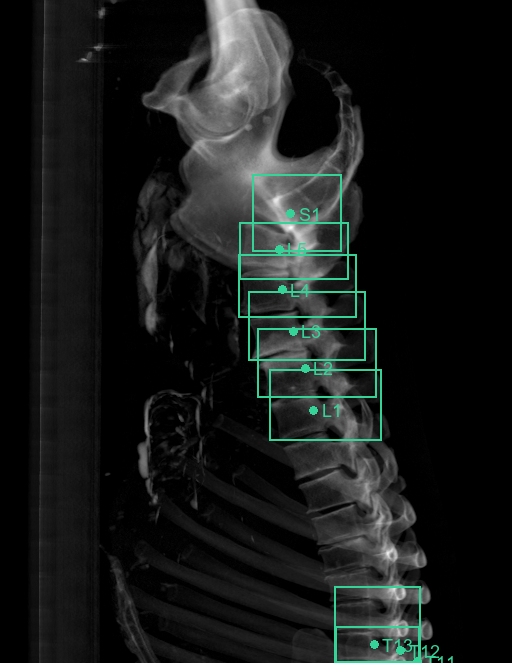

# XRSpinoPelvic1K

**An open spinal-radiograph (DRR) dataset + real-time vertebral-level localization — generated from segmented CT.**

> Spinopelvic alignment and intra-operative level-checking happen on **radiographs / fluoroscopy**, but there is **no open spinal X-ray dataset with vertebra-level labels** (the few that exist are private, and none include pelvis/femoral landmarks). XRSpinoPelvic1K closes that gap by *projecting* a fully-segmented CT dataset into **Digitally Reconstructed Radiographs (DRRs)** — yielding synthetic X-rays that come, for free, with **per-pixel vertebra masks and per-level landmarks** lifted from 3-D ground truth.

Built on [CTSpinoPelvic1K](https://github.com/Gregory-Schwing-MD-PhD/CTSpinoPelvic1K) + [OpenSpineToolkit](https://github.com/Gregory-Schwing-MD-PhD/OpenSpineToolkit).



*A lateral DRR rendered from one CTSpinoPelvic1K case (bone emphasis), with per-level boxes/landmarks (T11–S1) projected straight from the 3-D segmentation — no manual radiograph annotation.*

> ⚕️ **Research & educational use only — not a medical device, not for clinical or intra-operative use.**

---

## Why this exists

| | radiograph-only labeling | **XRSpinoPelvic1K (DRR from CT)** |
|---|---|---|
| 2-D labels | hand-drawn, scarce, private | **projected from 3-D masks — free, exact, at scale** |
| level identity under overlap | ambiguous | resolved by the 3-D source |
| pelvis / femoral landmarks | cropped out of most films | included where the CT FOV has them |
| posture | fixed by the acquisition | **arbitrary projection angles** (domain randomization) |

The same projection that makes the synthetic X-ray also carries the labels — so a model trained here learns the **projection (superposition) physics** real radiographs have, with ground truth a manual annotator can't produce.

## The pipeline

```
 CT volume (HU)  +  3-D segmentation (vertebrae, sacrum, hips, femurs)
        │                         │
        ▼  drr_project()          ▼  project_footprints() / project_level_points()
  synthetic radiograph  ─ paired ─  2-D vertebra masks  +  per-level landmarks (point + bbox)
        │
        ▼  build_dataset.py
  XRSpinoPelvic1K:  <view>_drr.png · <view>_mask.png · <view>_levels.json · manifest.csv
        │
        ▼  localize.py  (heatmap targets → CNN → real-time level readout)
  "the point under the C-arm is L4"
```

## What's here now

- **`xrsp/drr.py`** — parallel-beam DRR generator (lateral + AP), affine-aware orientation (superior up, anterior left). *Working + tested.*
- **`xrsp/project_labels.py`** — projects 3-D masks → 2-D footprints + per-level landmarks through the **identical** geometry, so image and labels stay registered. *Working + tested.*
- **`xrsp/build_dataset.py`** — CLI that turns a folder of `<case>_ct.nii.gz` / `<case>_label.nii.gz` into the full DRR dataset + manifest.
- **`xrsp/localize.py`** — level-localization: Gaussian-heatmap targets from landmarks, nearest-level readout (runnable), and a U-Net heatmap-regressor scaffold (PyTorch optional). *Targets/readout tested; trainer is scaffolded — see ROADMAP.*
- **`examples/0003/`** — a real lateral + AP DRR rendered from one CTSpinoPelvic1K case, with its projected mask + levels.
- **`tests/`** — synthetic-phantom tests proving DRR/label geometry alignment and heatmap round-trip.

## Quick start

```bash
pip install -e .

# one case -> a DRR + mask + per-level landmarks
python - <<'PY'
from xrsp.build_dataset import build_case
build_case("0003_ct.nii.gz", "0003_label.nii.gz", "out/0003", views=("lateral","ap"))
PY

# whole dataset
python -m xrsp.build_dataset --in /path/to/ct_label_pairs --out data/xrsp1k --views lateral ap
```

Localize a point on a generated DRR:
```python
import json
from xrsp import level_at_point
levels = json.load(open("out/0003/lateral_levels.json"))["levels"]
print(level_at_point(levels, (320, 410)))   # -> {'name': 'L4', 'distance_px': ...}
```

## Roadmap

- [x] DRR engine (parallel-beam) + label/landmark projection + dataset builder
- [x] Level-localization targets (heatmaps) + nearest-level readout + model scaffold
- [ ] Train the heatmap localizer on the full DRR set; evaluate on held-out cases
- [ ] **Domain randomization** (projection angle, intensity, scatter) + perspective/cone-beam (DeepDRR-style) for fluoroscopy realism
- [ ] **Domain adaptation / fine-tune** on real radiographs (e.g. BUU-LSPINE) → close the synthetic-to-real gap
- [ ] Real-time fluoroscopy inference loop (frame → level overlay)
- [ ] Release the rendered DRR dataset (DOI) with a dataset card

## License & citation

Code: **Apache-2.0** (see `LICENSE`, `NOTICE`). The rendered DRRs inherit the licenses of the
source CT (CTSpinoPelvic1K is **CC-BY-NC-4.0**; its constituents are CC-BY-3.0) — see
`docs/dataset_card.md`. If you use this, please cite XRSpinoPelvic1K, CTSpinoPelvic1K, and
OpenSpineToolkit.
