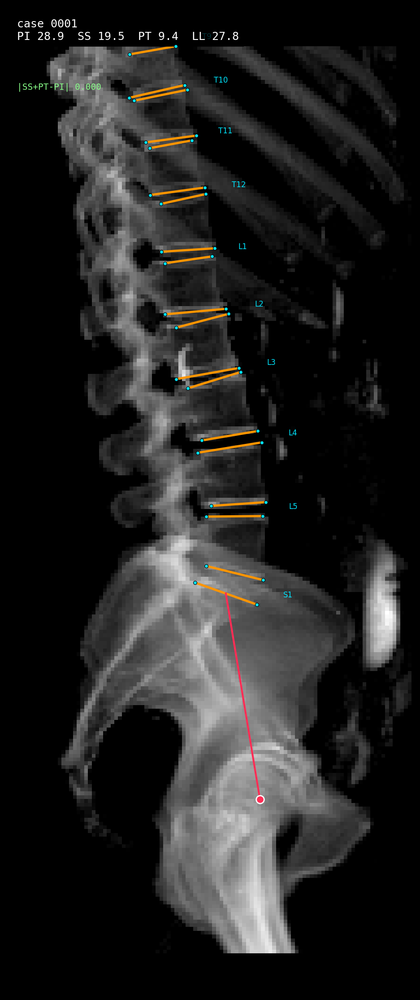
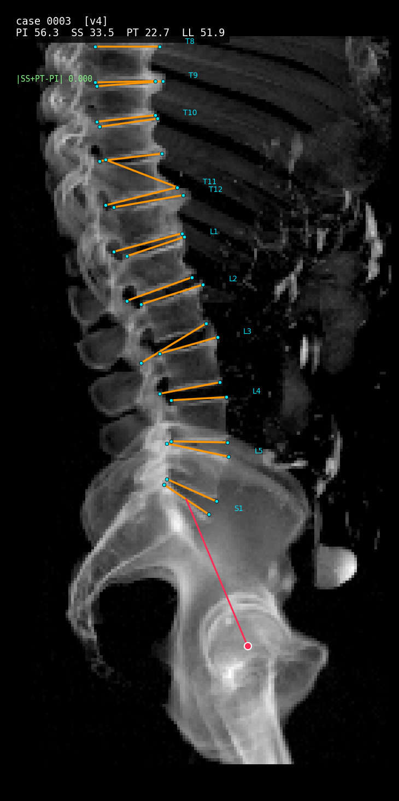

# XRSpinoPelvic1K

**An open spinal-radiograph (DRR) dataset + real-time vertebral-level localization — generated from segmented CT.**

> Spinopelvic alignment and intra-operative level-checking happen on **radiographs / fluoroscopy**, but there is **no open spinal X-ray dataset with vertebra-level labels** (the few that exist are private, and none include pelvis/femoral landmarks). XRSpinoPelvic1K closes that gap by *projecting* a fully-segmented CT dataset into **Digitally Reconstructed Radiographs (DRRs)** — yielding synthetic X-rays that come, for free, with **per-pixel vertebra masks and per-level landmarks** lifted from 3-D ground truth.

Built on [CTSpinoPelvic1K](https://github.com/Gregory-Schwing-MD-PhD/CTSpinoPelvic1K) + [OpenSpineToolkit](https://github.com/Gregory-Schwing-MD-PhD/OpenSpineToolkit).


*A lateral DRR rendered from one CTSpinoPelvic1K case (bone emphasis), with the **lumbosacral** level boxes/landmarks (L1–S1) projected straight from the 3-D segmentation — no manual radiograph annotation. (Thoracic levels are omitted here: this case's v3 thoracic GT is FOV-limited/merged — irrelevant to spinopelvic angles, which need only L1, S1 and the femoral heads.)*

> ⚕️ **Research & educational use only — not a medical device, not for clinical or intra-operative use.**

---

## Endplate corners and spinopelvic parameters

Every level that is visible gets **four corners** — the two ends of its superior and its
inferior endplate — plus a bicoxofemoral point, so PI, SS, PT and LL follow directly.
S1 gets a superior endplate only: it is fused to S2, so there is no inferior plate to
mark. (BUU-LSpine's radiologists annotate `S1a` with no `S1b` for the same reason.)





*Orange = endplate lines through the fitted corners; cyan = the four corners per level;
red = the PI construction, from the S1 endplate midpoint to the bicoxofemoral axis.
Both cases carry the PI identity `|SS + PT − PI| ≤ 0.001°`.*

### How the corners are found

Corners come from the **3-D mask**, then project — never from the 2-D silhouette. That
is not a preference: fitting the S1 endplate from the silhouette is **26–32° wrong at
every slab fraction**, because the sacral ala superimposes on the S1 body and no amount
of 2-D reasoning separates them. Fitted in 3-D and projected, the same endplate lands
within ~0.6°. This is the whole reason the dataset is generated from CT.

The construction follows the radiographic literature rather than being invented here:

| step | method | source |
|---|---|---|
| isolate the vertebral **body** | spinal canal as separator (a topological hole per axial section); distance-transform watershed as fallback | Yao ISBI 2006; Naegel 2007 |
| body coordinate system | posterior wall = the canal's anterior edge, per section | Mastmeyer *Med Image Anal* 2006 |
| endplate + wall profiles | robust degree-2 model under Tukey IRLS — one concavity only, so a spur or a Schmorl's node cannot be represented and gets zero weight | Štern *Phys Med Biol* 2011; Roberts *Invest Radiol* 2006; de Bruijne *Med Image Anal* 2007 |
| corner | endplate tangent ∩ cortical wall, not the extreme voxel | Frobin *Clin Biomech* 1997; Hurxthal *AJR* 1968 |
| exclude osteophytes | they are outliers to both the plate and the wall | Genant *JBMR* 1993; Black *JBMR* 1995 |

### What actually needs to be accurate

Not every corner matters equally, and this is measurable. Sliding every corner ±2.5 mm
**along its own endplate line** (direction preserved — the error mode that actually
occurs) gives:

```
perturb every corner EXCEPT S1 :  SS 0.000  LL 0.000  PI 0.000  PT 0.000
perturb ONLY S1                :  SS 0.000  LL 0.000  PI 0.589  PT 0.589
```

**SS and LL are exactly invariant** — both are angles between *lines*, and sliding an
endpoint along a line does not move the line. PI and PT depend on S1 only through the
plate **midpoint**, so symmetric corner error cancels there too. Of ~20 corners in a
case, **only S1's two affect any spinopelvic parameter**; the rest matter as landmark
training labels.

### Validation against real reader annotations

`scripts/buu_convention.py` scores the generated corners against **BUU-LSpine 400** —
reader-placed corners on real lateral radiographs. The two cannot be compared
point-for-point (different patients, CT vs radiograph), so the comparison uses
**scale-free** quantities: lordosis angles, the wedge between a vertebra's own two
plates, endplate span / body height, and the S1 plate's length and angle relative to L5.

```
metric                BUU p5-p95     ours
LL                    20.4 - 67.2    in band
s1_vs_L5inf_deg        2.8 - 25.8    in band
s1_vs_L1sup_deg       19.7 - 67.0    in band
s1_over_L5sup          0.8 - 1.1     1.1   (was 1.5 before the ala fix)
wedge_L5               0.4 - 10.6    13.6  OUT
```

**Known gaps.** `wedge_L5` sits outside the reader band across every revision so far, and
the S1 plate is still marginally long. Upper-lumbar disc angles run lower than readers',
which is expected and *not* corrected for: CTSpinoPelvic1K is **supine CT** and BUU is
**standing radiography**, and lordosis unloads supine. Tuning that away would be fitting
posture, not anatomy.

---

## Why this exists

| | radiograph-only labeling | **XRSpinoPelvic1K (DRR from CT)** |
|---|---|---|
| 2-D labels | hand-drawn, scarce, private | **projected from 3-D masks — free, exact, at scale** |
| level identity under overlap | ambiguous | resolved by the 3-D source |
| pelvis / femoral landmarks | cropped out of most films | included where the CT FOV has them |
| posture | fixed by the acquisition | **arbitrary projection angles** (domain randomization) |

The same projection that makes the synthetic X-ray also carries the labels — so a model trained here learns the **projection (superposition) physics** real radiographs have, with ground truth a manual annotator can't produce.

## The pipeline

```
 CT volume (HU)  +  3-D segmentation (vertebrae, sacrum, hips, femurs)
        │                         │
        ▼  drr_project()          ▼  project_footprints() / project_level_points()
  synthetic radiograph  ─ paired ─  2-D vertebra masks  +  per-level landmarks (point + bbox)
        │
        ▼  build_dataset.py
  XRSpinoPelvic1K:  <view>_drr.png · <view>_mask.png · <view>_levels.json · manifest.csv
        │
        ▼  localize.py  (heatmap targets → CNN → real-time level readout)
  "the point under the C-arm is L4"
```

## What's here now

**Generation (`xrsp/`)**
- `drr.py` — parallel-beam DRR, axis-aligned lateral/AP
- `oblique.py` — **arbitrary-angle** DRR + geometry-consistent label projection, 4-corner
  extraction per vertebra, selectable PI anchor
- `project_labels.py` — 3-D masks → 2-D footprints + per-level landmarks
- `build_dataset.py` — dataset builder; `--oblique N` emits N randomised views per CT
- `splits.py` — patient-grouped, LSTV-stratified 5-fold splits with a leakage assertion

**Model (`xrsp/`)**
- `heatmaps.py` — Gaussian targets, masked loss, sub-pixel soft-argmax decode
- `dataset.py` — torch dataset; derives the channel set from the data
- `model.py` — MONAI `BasicUNet` + a Lightning module
- `measure.py` — PI / SS / PT / LL / segmental angles **from landmarks alone**

**Entrypoints (`scripts/`)** — `make_splits.py`, `train_landmarks.py`, `evaluate.py`,
`evaluate_buu.py`, `make_reader_set.py`

**Grid (`docker/`, `containers/`, `slurm/`)** — see [docs/HPC.md](docs/HPC.md)

## The measurement that motivates all of this

On a lateral projection the sacral ala superimposes on the S1 body, so the S1 endplate
**cannot be recovered from what is visible**. Fitting it from the projected silhouette
is **26–32° wrong** — at every slab fraction from 0.30 down to 0.04, so it is not a
tuning problem. The medial–lateral coordinate that separates ala from body does not
survive projection.

Fit the endplate in **3-D** and project the result, and the same case comes out at
**0.6°**:

| | from 2-D landmarks | ostk 3-D | Δ |
|---|---|---|---|
| SS | 32.89° | 32.31° | **0.58°** |
| LL | 45.06° | 45.70° | **0.64°** |

So the target is recoverable **iff the ground truth comes from 3-D** — which is exactly
what a model trained on projected labels can learn, and what a human annotating the film
cannot produce. Published manual inter-rater ICC for the sacral endplate runs as low as
**0.41**, and the cause named in the literature is that same overlap.

## Quick start

```bash
pip install -e .
# needs OpenSpineToolkit for the 3-D endplate fit:
pip install git+https://github.com/Gregory-Schwing-MD-PhD/OpenSpineToolkit.git

# 1. generate: 8 randomly-oblique lateral views per CT, labels + 4 corners per
#    visible vertebra + the bicoxofemoral point, all projected through the same geometry
python -m xrsp.build_dataset --ct_dir data/ct --label_dir data/labels     --out data/xrsp1k --oblique 8

# 2. splits (once — commit the result)
python scripts/make_splits.py --manifest data/cases.csv --out data/splits.json

# 3. train one fold
python scripts/train_landmarks.py --data data/xrsp1k --splits data/splits.json     --fold 0 --out runs/f0

# 4. evaluate
python scripts/evaluate.py --data data/xrsp1k --splits data/splits.json     --fold 0 --ckpt runs/f0/best.ckpt --out results/f0
```

On the grid it is `make image` → `make container` → `make generate` → `make splits`
→ `make train` → `make eval`. See [docs/HPC.md](docs/HPC.md).

## Validation design

Three evaluations answering three different questions — the distinction matters and is
easy to get wrong. Full rationale in [docs/PIPELINE.md](docs/PIPELINE.md).

| | measures | ground truth |
|---|---|---|
| **Held-out DRRs** | did the net learn the target | amodal, exact — but same renderer, so **in-silico** |
| **BUU Spine** | does it transfer to real films | human corners — **modal**, so this is agreement, not accuracy |
| **DRR reader study** | the human noise floor and **signed bias** | amodal truth vs blinded readers |

The third makes the second interpretable: if the model departs from BUU's human
annotations *by the same signed bias* the reader study measures, that is evidence the
readers are systematically wrong — not the model. Without it, disagreement on BUU reads
as failure. And none of it needs paired CT/radiograph subjects.

## Testing

```bash
make test        # 14 tests, no GPU or container required
```

They guard the failures that would be invisible in the metrics: view leakage across
folds, absent landmarks being zero-supervised, channel-order drift, and the
`PI = SS + PT` identity.

## License & citation

Code: **Apache-2.0** (see `LICENSE`, `NOTICE`). The rendered DRRs inherit the licenses of the
source CT (CTSpinoPelvic1K is **CC-BY-NC-4.0**; its constituents are CC-BY-3.0) — see
`docs/dataset_card.md`. If you use this, please cite XRSpinoPelvic1K, CTSpinoPelvic1K, and
OpenSpineToolkit.
