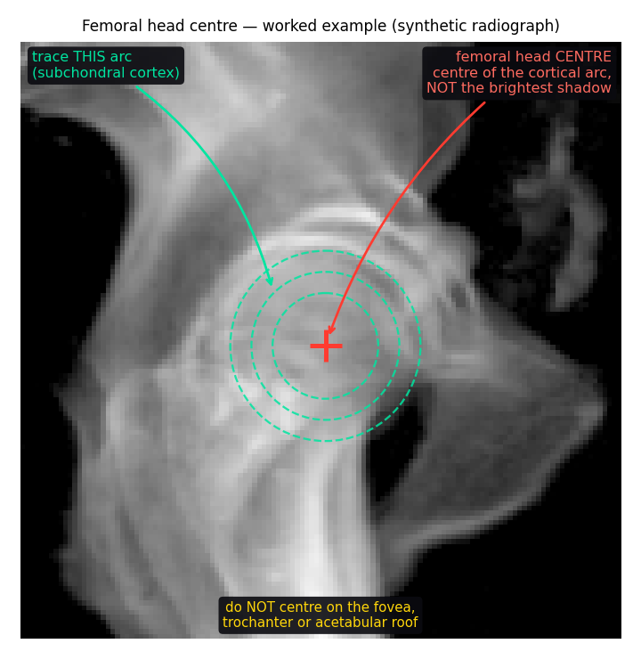

# Femoral head annotation

Two clicks per lateral radiograph: left femoral head centre, then right.

## Why this exists

The hip point in XRSpinoPelvic1K is learned from **synthetic DRRs**, where the ground
truth is a 3-D sphere fitted to the femoral head and projected. BUU — the only large
public set of real lateral films — annotates L1–L5 and S1 and **nothing pelvic**, so
there is currently no way to measure whether that synthetic hip point survives contact
with a real radiograph. Without it, PI cannot be validated at all.

These annotations are a **reference set, not training data**. Test split only.

## What you are marking

The hip axis is the line joining the **centres of the two femoral heads**; the point used
for PI/PT/SS is its midpoint (Legaye & Duval-Beaupère, *Eur Spine J* 1998). The femoral
head is very nearly a sphere, so its projection is a circle — you are marking **the centre
of that circle**, a geometric centre rather than a surface point.

**Method.** Trace the *subchondral cortical arc* — the thin dense line of the articular
surface — and mark its centre of curvature. This is the Mose concentric-circle template
done by eye, which is why the worked example draws concentric rings. Use the 4× magnifier.

**The trap.** Do not aim at the brightest shadow. Overlap with the acetabulum and the
opposite head puts the densest region *medial* to the true centre, so "centre of the
bright blob" is biased rather than merely noisy.

**Never centre on:** the fovea capitis (the medial notch — a defect in the sphere), the
greater trochanter, the femoral neck or head–neck junction, the acetabular roof or
teardrop.

**One circle or two.** On a well-positioned lateral the heads superimpose — mark it as
LEFT and leave RIGHT empty. If rotation separates them, mark both; the midpoint is derived
and the separation is recorded, because a wide separation means an oblique film and the
parameters from it are less trustworthy.

**Skip** for a prosthesis, heads outside the collimated field, or an exposure where the
cortical arc cannot be traced.

The example is a **synthetic** radiograph on purpose: there the centre is a 3-D sphere fit
projected through the imaging geometry, so it is objectively correct rather than one
annotator's opinion. A marked-up real film would put whoever marked it into every reader's
head.

## Rules that make the reference worth having

**No automatic proposal is ever shown.** Not the model's prediction, not the classical
circle fit. Displaying a starting point would anchor the annotator to it, and agreement
would then measure suggestibility rather than anatomy.

**Both heads, separately.** The bicoxofemoral point is defined as the midpoint of the two
femoral head centres (Legaye & Duval-Beaupère 1998). Marking both lets the midpoint be
derived, lets their separation flag an oblique film, and lets you mark one when the other
is genuinely invisible.

**Skip freely.** A forced guess on an unreadable film is worse than no annotation — this
set exists to be the reference, so a fabricated point becomes a fabricated error in
whatever it validates.

**Two annotators per film**, with the mean taken on agreement (≤2% of image width) and
disagreements escalated to an adjudicator. Same claim/slot/TTL model as the segmentation
review Space, so it should feel familiar.

## Setup

Space secrets:

    HF_TOKEN       write token for the ledger dataset
    ANNOT_REPO     <org>/xrsp-femhead-annot
    IMAGE_REPO     <org>/xrsp-femhead-images
    ADJUDICATORS   comma/space-separated HF usernames

Seed the ledger and upload the films:

    python annot/seed_cases.py --buu data/BUU-LSPINE --splits data/buu_splits.json \
        --annot-repo <org>/xrsp-femhead-annot --image-repo <org>/xrsp-femhead-images \
        --n 120 --apply

Annotators paste their own HF token; the Space verifies it with `whoami` and uses the
returned username as identity. It caches only `sha256(token) -> username`, never the token.
Films are streamed **through** the Space, so annotators need no read access to any dataset.
